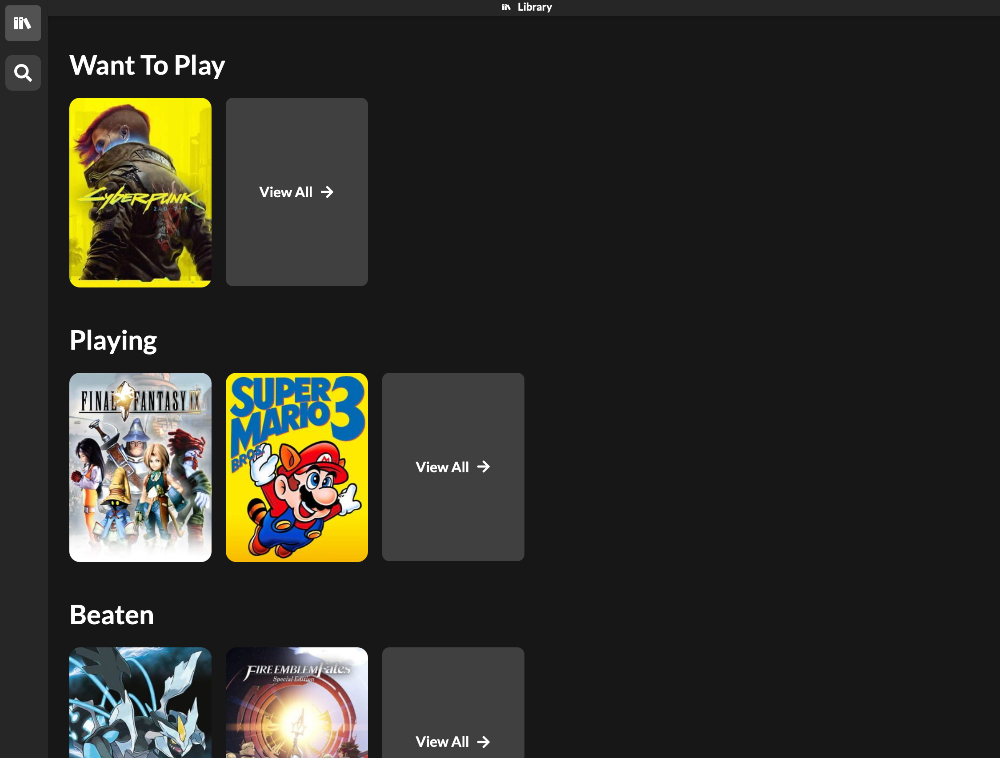
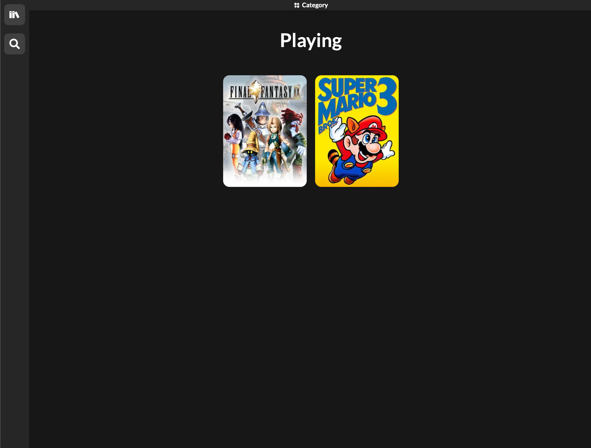
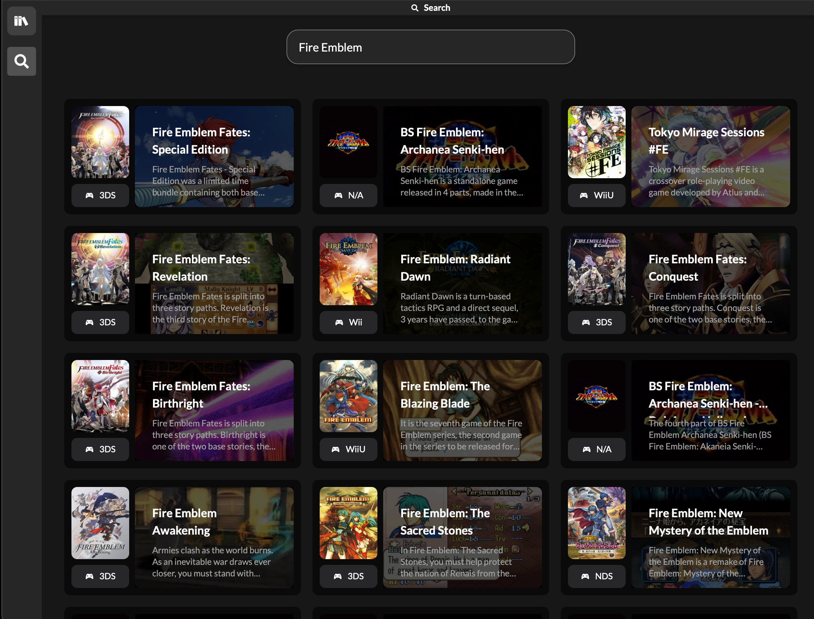
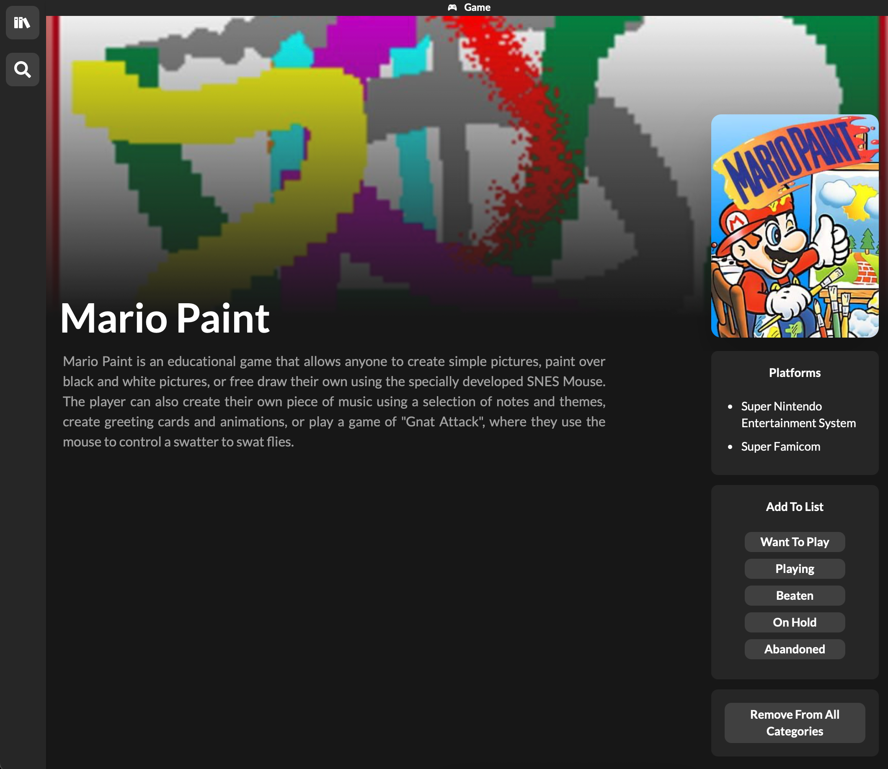

# GamePile: A simple game backlog manager

GamePile is a simple video game backlog manager powered by the IGDB database, React and Tauri, built to learn React, TypeScript and external API calls.

<p>
    
    
    
    
</p>

## Why?

Many video game backlog management services are tied to a website, where you often *do not* have the ability to export your backlog to be saved locally. This means that a big collection can be lost at the will of the service provider. Although it is much simpler than many of these services, GamePile aims to alleviate some of these issues by:

- Saving all game information in a local SQLite database
- Being ran as a standalone executable, rather than a web app
- Be semi-offline compatible, being able to view your backlog while offline
  - Search is still tied to an Internet connection

## Installation

To get started, clone this repository. Then, go to [the IGDB API docs](https://api-docs.igdb.com/#getting-started) and follow the steps to get an API key.

After getting your Client_ID and Authorization, create a file called `.env` in the `src-tauri` folder. Structure it as below:

``` dotenv
IGDB_CLIENT_ID="your_client_id"
IGDB_AUTHORIZATION="your_authorization"
```

Once this is complete, you can now run and test the program with:

``` sh
npm run tauri dev
```

This will open a live dev environment.
